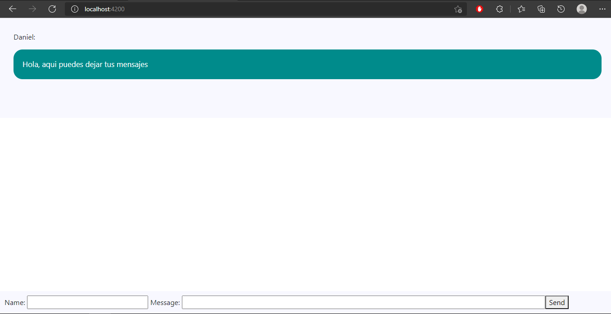
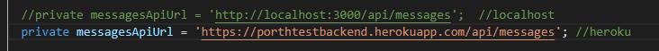
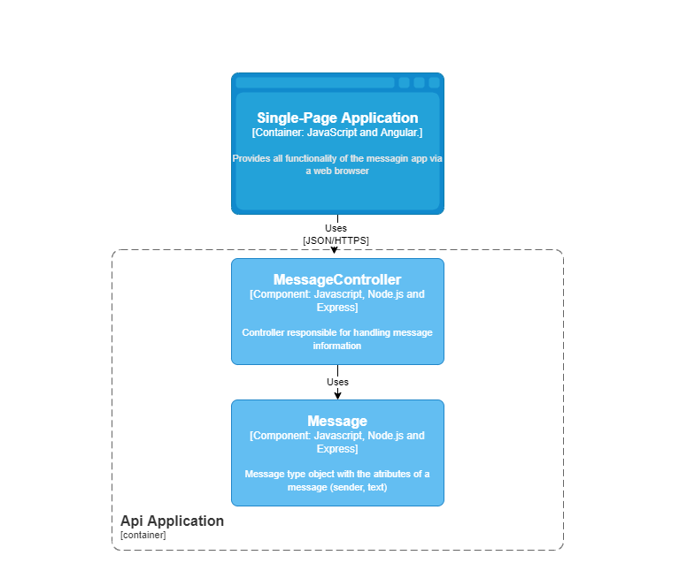
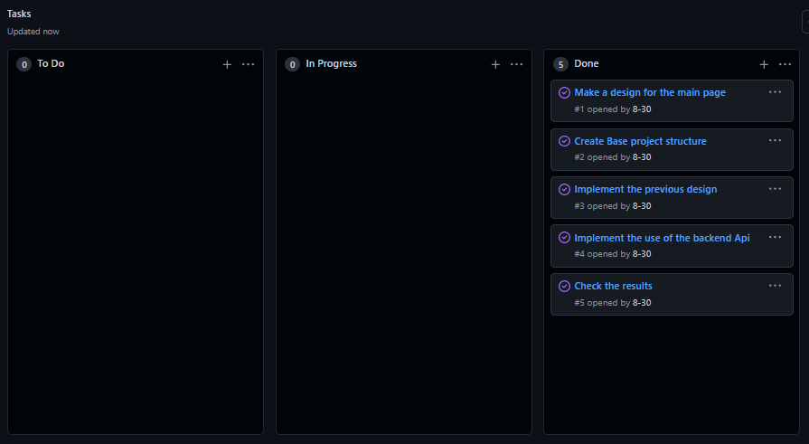

# PorthTestFrontend

This following program is the backend solution for the PORTH test.
This project was generated with [Angular CLI](https://github.com/angular/angular-cli) version 12.0.0.

This project is hosted at "https://porth-test-front-end.vercel.app/"

## Run server

Run `ng serve` for a dev server. Navigate to `http://localhost:4200/`.

NOTE: The api that this app consumes is pointing to the backend hosted at https://porthtestbackend.herokuapp.com/api/messages
if you want to use this app with the backend running locally, go to the file src/app/services/message.service and comment line 21 and enable line 20

## Description
Hacer una página para dejar mensajes, donde puedas entrar por medio de un explorador web, dejar un mensaje y que quede persistente, si vuelves a entrar a la página, todos los mensajes que se hayan enviado deben seguir ahí.

## Arquitecture

The functional structure of the program was modeled using the c4 model components diagram

## Approach and Methodology

For exercise development first I read the problem carefully until I found a possible solution, then I translated the solution in pseudo code to check if it would be useful, once my solution was verified I proceeded to design the component diagram and finally assemble the project structure and implement the solution.

I Manage all my tasks using a proyect within the github repository created for the exercise.

